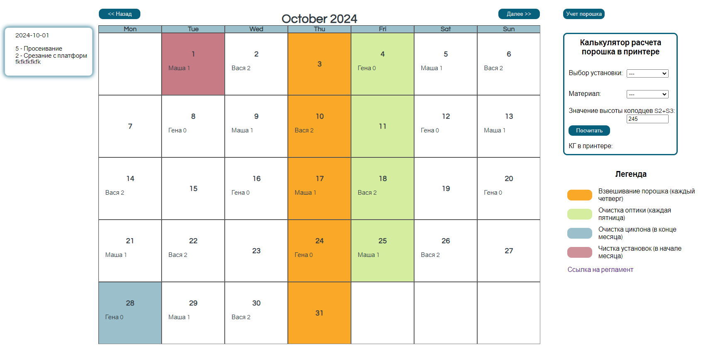
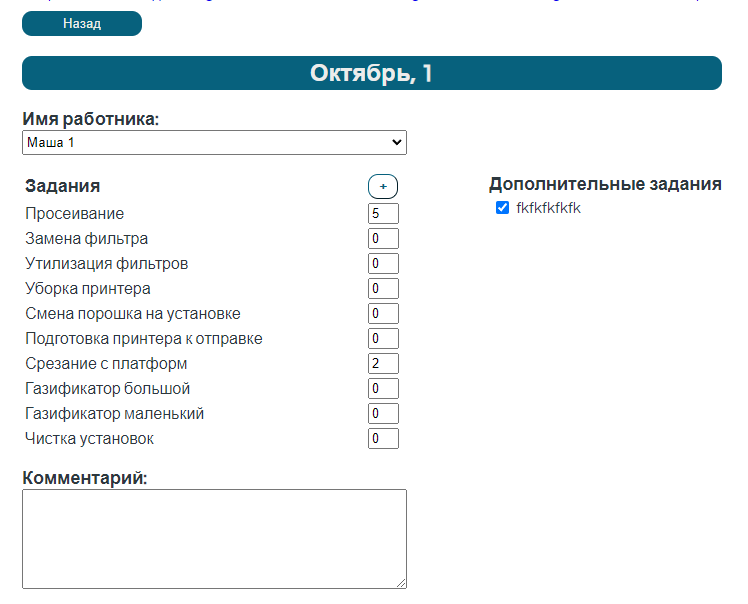
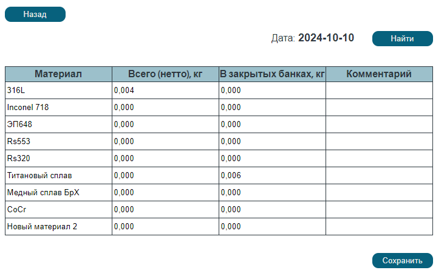
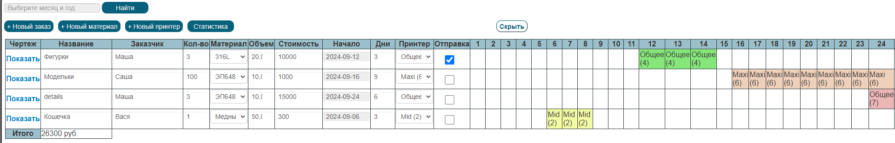
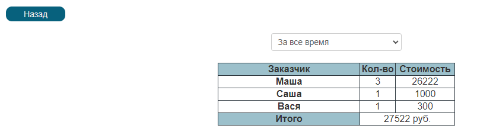

This project was developed for the company I work at.

The project contains three parts:
1. Calendar for operators who work day after three;
2. Printing Register to monitor orders;
3. Printing Plan to schedule printing on 3D-printers.

# Calendar
The calendar was developed for operators who work day after three. It sets schedule automatically.
Operators have to do some tasks each day they work, tasks are also set automatically. When an operator does smth, he/she should note how many times the task was done during the day.
Some days are marked with color according to legend provided on the right bottom part of the page. Color means that the operator has to do some special task. Special tasks are also set automatically.
Also, when a mouse hovers a day inside calenda, the popup appears. It shows which tasks were done during the day and how many times.

If the day inside caledar is clicked, the server redirects a user to the page of the day. Operators can edit tasks here. Also, an extra task can be added for a day. Extra tasks are additional tasks, they can't be set automatically because they do now follow task templates.

POST-requests are sent to server using AJAX.

Also, operators have to keep records of the of the remaining powders every thursday.

# Printing Register
The Printing Register was developed for engineers to monitor orders and get financial statistics of a time period. 
New orders should be added through the form ("+Новый заказ").
The table is editable, so an engineer can change order name, customer, material etc. 

The financial statistics shows all orders during some time period (all time, this year, manually set period). Rows of the table can be sorted by clicking on the table header.

# Printing Plan
Is being developing...
